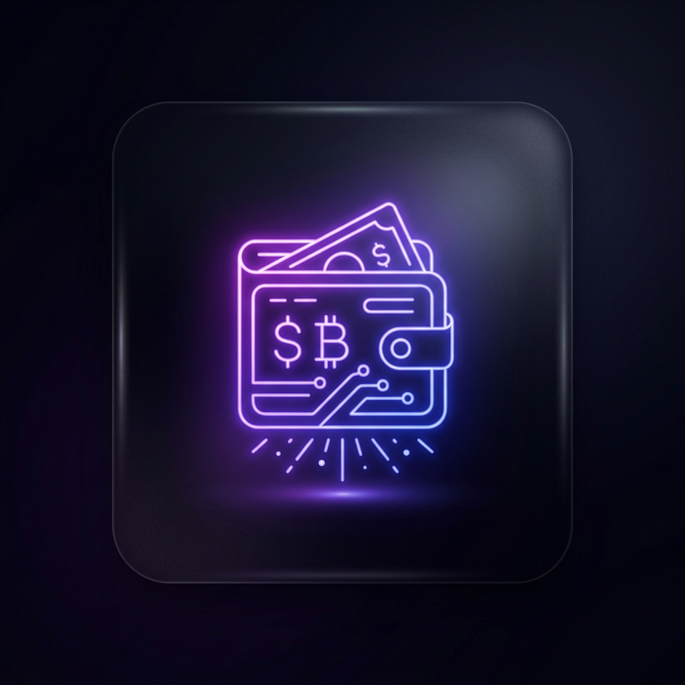
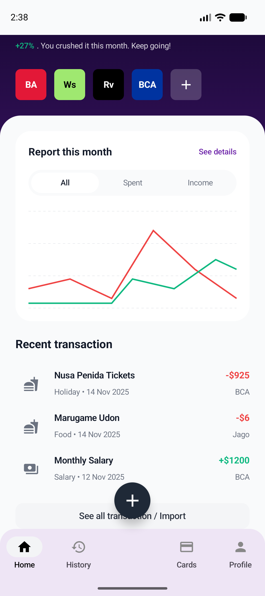
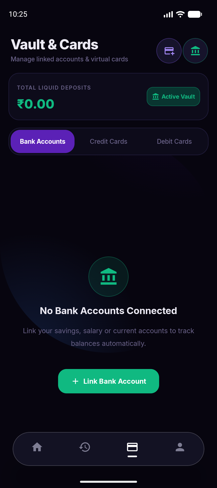
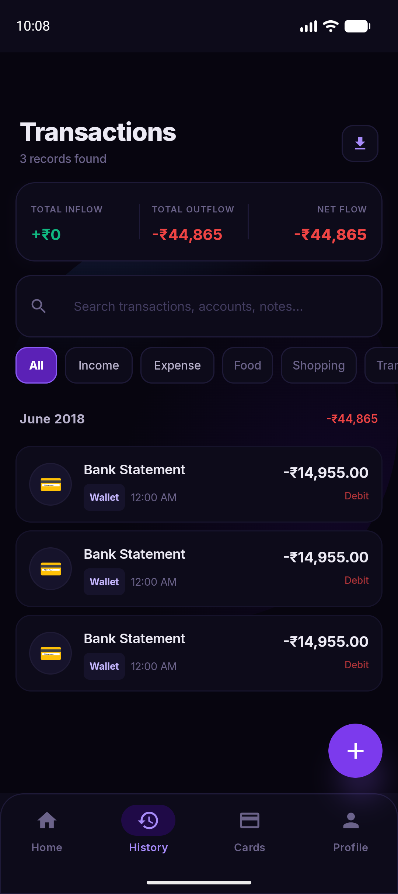
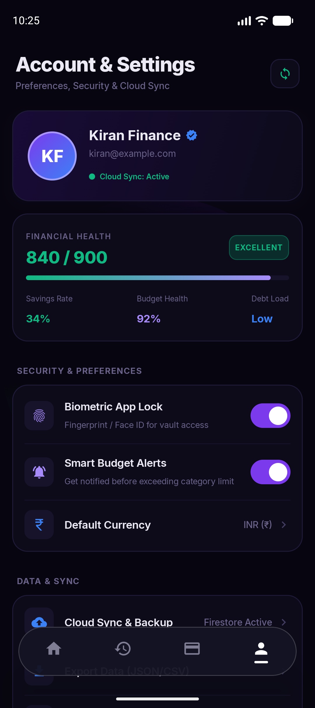

# Kiran's Finance 💳

**Kiran's Finance** is a state-of-the-art, ultra-premium personal finance and wealth management application built on Android with Jetpack Compose. It tracks your income, expenses, investments, and more through an incredibly beautiful, fluid, and immersive UI.

---

## 🌟 The Best UI Experience on Android
We set out to build the absolute best UI available on any finance app. 
Kiran's Finance leverages a completely custom, cutting-edge **Glassmorphism Design System**:

*   **Immersive Glass Surfaces:** Every card, button, and surface in the app is built from semi-transparent frosted glass.
*   **Fluid Neon Backgrounds:** The background isn't a static color. It's a living, breathing canvas of fluid red, blue, green, and yellow neon orbs that slowly orbit behind the frosted glass, giving the app a living, organic feel.
*   **Physical Interactions:** No cheap default Android ripples. Tapping any card or button triggers a fully custom physics-based `bounceClick` animation, making elements physically depress into the screen and bounce back up.
*   **Staggered Entrance Animations:** The dashboard and screens don't just "appear". They elegantly cascade and slide into view, piece by piece.
*   **Premium Typography & Layout:** Clean lines, precise padding, and beautiful typography make parsing your complex financial data effortless and a joy to read.

---

## 📸 Screenshots

| Dashboard | Cards Wallet | History | Profile |
| :---: | :---: | :---: | :---: |
|  |  |  |  |

---

## 🚀 Features

*   **Comprehensive Dashboard:** View your Total Balance, Income vs. Expenses, and Quick Actions at a glance.
*   **Smart Categorization:** Easily log expenses and incomes with customized categories and colors.
*   **Digital Wallet & Bank Cards:** Store your virtual credit cards, titanium cards, and bank details with glorious metallic and gradient representations.
*   **EMI & Loan Calculators:** Powerful built-in tools to calculate EMIs, compare loans, and plan your debts.
*   **Investment Tracking:** Keep an eye on stocks, mutual funds, real estate, and crypto portfolios.
*   **Detailed History & Analytics:** Full transaction histories with custom glassmorphism list items and filtering.

---

## 🛠 Tech Stack & Architecture

*   **Language:** Kotlin 1.9+
*   **UI Toolkit:** Jetpack Compose (100% Declarative UI)
*   **Architecture:** Clean Architecture + MVVM (Model-View-ViewModel)
*   **State Management:** StateFlow & Kotlin Coroutines for asynchronous, reactive data streams
*   **Navigation:** Jetpack Navigation Compose with custom physics-based `FastOutSlowIn` transitions
*   **UI Styling:** Custom Glassmorphism UI framework building upon Material 3 primitives with `Modifier.graphicsLayer` advanced render effects
*   **Database & Auth:** Firebase Firestore (NoSQL Document DB) & Firebase Authentication
*   **Background Processing:** WorkManager for secure, offline-capable syncing of statements
*   **Dependency Injection:** Manual/Hilt ready structure

---

## 💡 Powered by Gemini
The development and design of this application were accelerated and powered by Google's Gemini AI, focusing on extreme UI/UX polish and complex declarative UI animations.
